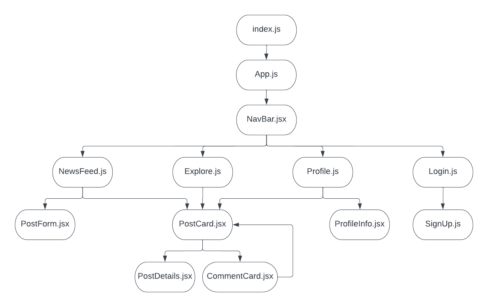
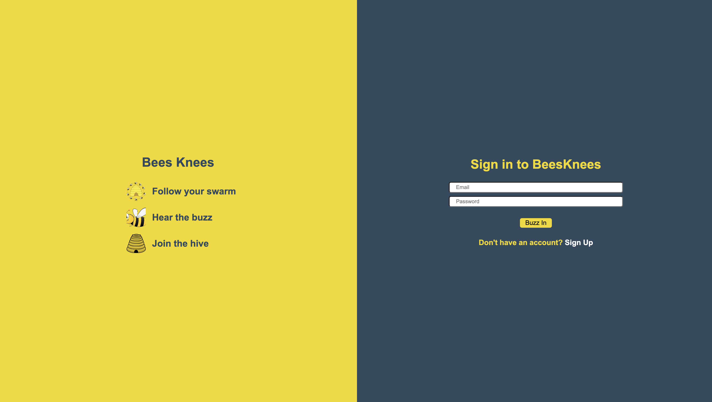
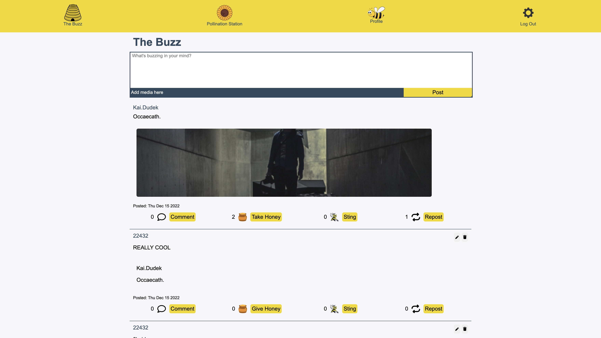
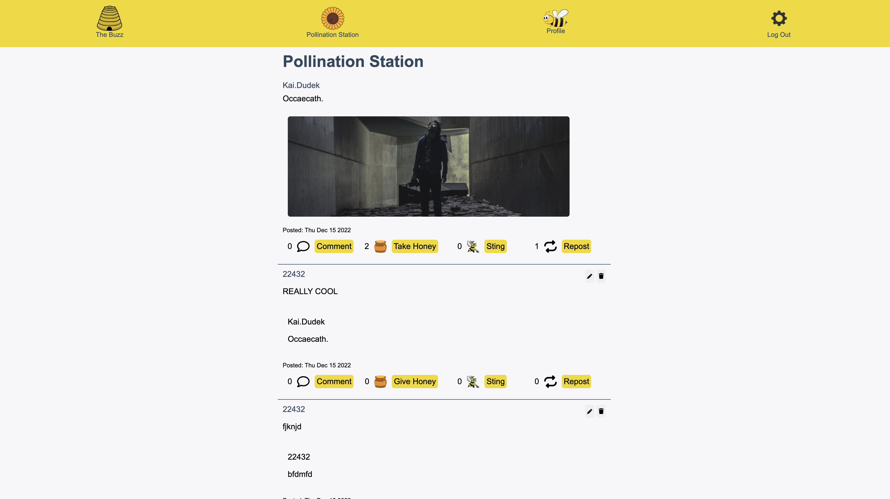
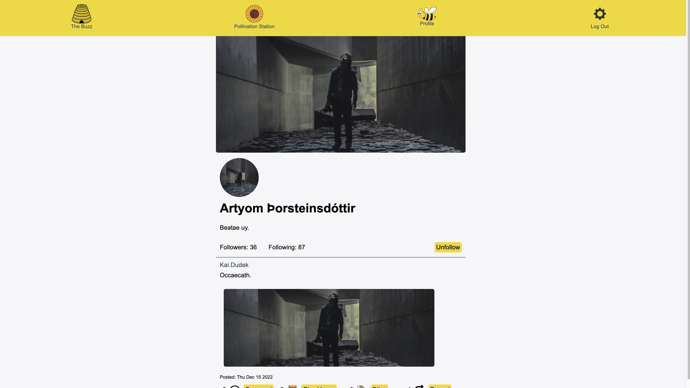

# BeesKnees Frontend

## Date: 12/7/2022

### By: Kalen Luciano: [GitHub](https://github.com/kalenluciano) | [LinkedIn](https://www.linkedin.com/in/kalenluciano/)

#### [BeeKnees Backend](https://github.com/kalenluciano/bees-knees-backend)

#### [Deployed Site](https://bees-knees-frontend.herokuapp.com)

---

### **_Description_**

This app allows users to post content, follow other users, and interact with other users' posts through likes, dislikes, comments, and reposts.

The news feed, called The Buzz, displays the most recent posts from a user's followers. The explore page, called Pollination Station, renders the most recent posts from all users. A user can click on a profile and follow other users.

When a user clicks on a post, the page recursively renders all of the post's comments and their related comment threads. The counts for followers, following, reactions, comments, and reposts all update based on a user's interaction with portfolios and posts.

Join the hive!

---

### **_Getting Started_**

-   `Fork` and `clone`
-   Run `npm install`
-   Run `npm start`

A Trello board was used to keep track of development progress and can be viewed [here](https://trello.com/b/2omo5oFi/beesknees).

---

### **_Technologies_**

-   React.js
-   JavaScript
-   CSS
-   HTML

**_Component Hierarchy Diagram:_**

---

### **_Screenshots_**

#### Login Page

#### News Feed

#### Explore Page

#### Profile Page

---

### **_Future Updates_**

-   [ ] Add a search feature to find posts with specific words
-   [ ] Load a limited amount of posts at a time and conditionally render more when a user scrolls to the bottom of the rendered posts
